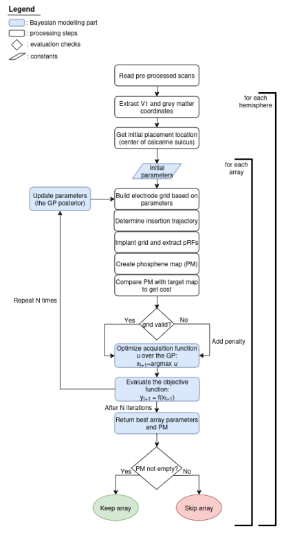

<h1 style="text-align: center;">MSc thesis in Artificial Intelligence, Utrecht University </h1>

<h2 style="text-align: center;">Bayesian optimization for the informed placement of multi-array brain electrodes in advanced visual cortical prostheses
</h2>

In short, this work uses MRI scans and retinotopy data to place multiple electrode arrays in the visual centers of the brain. It is aimed for a visual cortical prosthesis designed to restore a rudimentary form of vision in blind patients, and it was part of the [INTENSE consortium](https://intenseproject.eu/). The optimization procedure places the arrays in a way that optimizes the generated artificial vision.

<h3 style="text-align: center;">Abstract</h3>

Recent advances in neurotechnology and artificial intelligence have paved the way for restoring a rudimentary form of vision in blind patients by electrically stimulating the visual areas of the brain. Finding the proper location in the brain in a non-surgical way poses a significant challenge for the planning and implementation of visual cortical prostheses.

This research presents a Bayesian optimization pipeline for the informed placement of multi-array brain electrodes in advanced visual cortical prostheses. The procedure is based on individual MRI scans and retinotopy data from the Human Connectome Project, allowing to find the array parameters and the exact brain location that provide the closest match to a predetermined visual field coverage. The procedure is tested for multiple arrays of two types in the V1 area of the brain: 5 arrays of a theoretical three-dimensional type of 1000 electrodes in each array; and 16 two-dimensional arrays of 100 electrodes each, modelling the Utah array, which is widely used in research and clinical practice. The pipeline can easily be configured for an arbitrary number of arrays, to simulate different array designs, to cover a specific part of the visual field, and to include placement in different cortical visual areas.

Results show that the inclusion of additional arrays substantially increases the visual field coverage compared to using one array, and that using individual anatomical scans offers a great advantage compared to average brain solutions. Therefore, the pipeline can be a valuable tool in designing and planning novel types of brain-interfacing visual cortical prostheses.

<h3 style="text-align: center;"> Flow of the pipeline</h3>

  

<h3 style="text-align: center;"> Example results</h3>

Some example results can be found in [this](https://my-thesis-ai.appspot.com/) dash app.
It visualizes the array location in the brain, as well as the predicted generated artificial vision.

